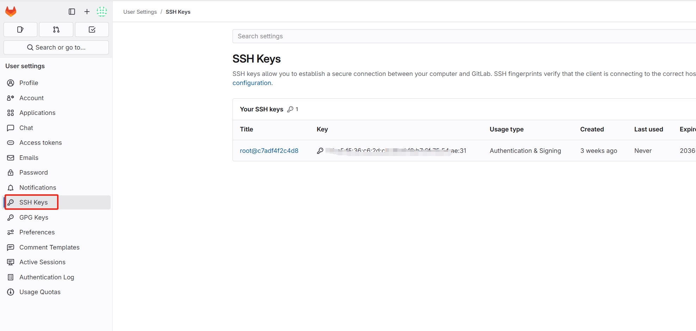

### 	1、CI/CD环境搭建之安装gitlab

## 1、概述

项目开发好后，我们需要部署项目到线上，这里基于gitlab + jenkins + harbor + k8s 来搭建CI/CD部署环境，注意：这里的k8s使用的runtime是containerd。

harbor : 镜像仓库

gitlab : 远程代码仓库，用来做CI

jenkins ：用来做CD，也就是部署应用到k8s

k8s : 容器管理集群

我们这里的例子的harbor、gitlab、jenkins的部署方式是docker-compose部署的，并不是运行在k8s集群里面，harbor、gitlab、jenkins都部署在同一个服务器上，
另外mysql数据库也是独立于k8s部署的，由于部署k8s太过繁杂，这里不做详细描述，可以在GitHub上找到很多基于二进制部署k8s的文章。


#### 2、gitlab

##### 2.1 部署gitlab

在/root下创建gitlab文件夹

```shell
$ mkdir gitlab && cd gitlab
$ vim docker-compose.yml
```

docker-compose.yml

```yaml
version: "3.7"
services:
   gitlab:
     image: "gitlab/gitlab-ce:latest"
     restart: always
     hostname: "192.168.211.150"
     container_name: gitlab-ce
     environment:
       GITLAB_OMNIBUS_CONFIG: |
         external_url 'http://192.168.211.150'
     ports:
       - "80:80"
       - "8443:443"
       - "2222:22"
     volumes:
       - "/home/docker/gitlabce/config:/etc/gitlab"
       - "/home/docker/gitlabce/logs:/var/log/gitlab"
       - "/home/docker/gitlabce/data:/var/opt/gitlab"
     networks:
       - gitlab
   gitlab-runner:
     image: gitlab/gitlab-runner:alpine
     container_name: gitlab-runner
     restart: always
     depends_on:
       - web
     volumes:
       - /var/run/docker.sock:/var/run/docker.sock
       - "/home/docker/gitlabce/gitlab-runner:/etc/gitlab-runner"
     networks:
       - gitlab

networks:
   gitlab:
     name: gitlab-network
```

执行

```shell
$  docker-compose up -d
```
执行时间有点长，耐心等待

##### 2.2 访问gitlab

访问 http://192.168.211.150（docker-compose中的hostname设置的ip/域名）


首次设置新密码  ： 123456789

账号默认是root


##### 2.3 配置ssh公钥
公钥生成方法自行网上搜索，这里不做描述



##### 2.4 创建项目并上传代码


​	


