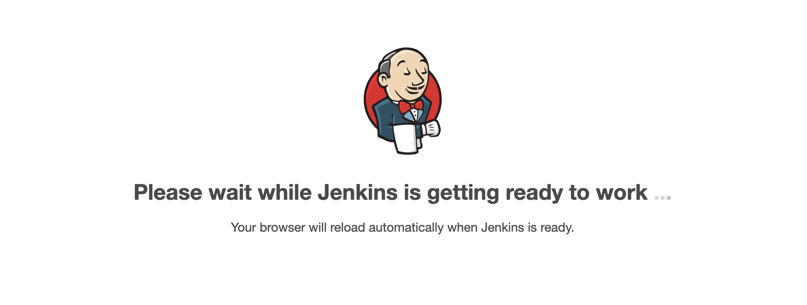
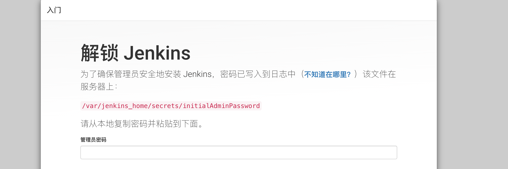
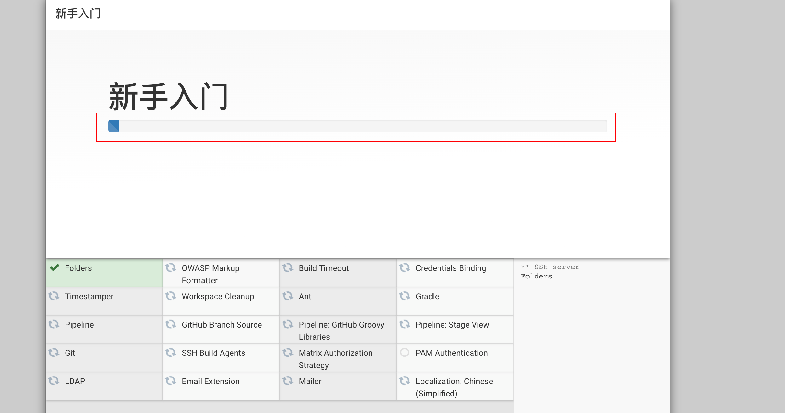
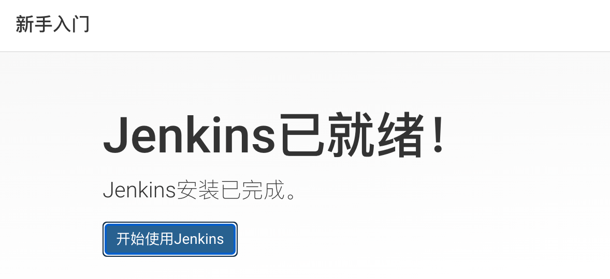
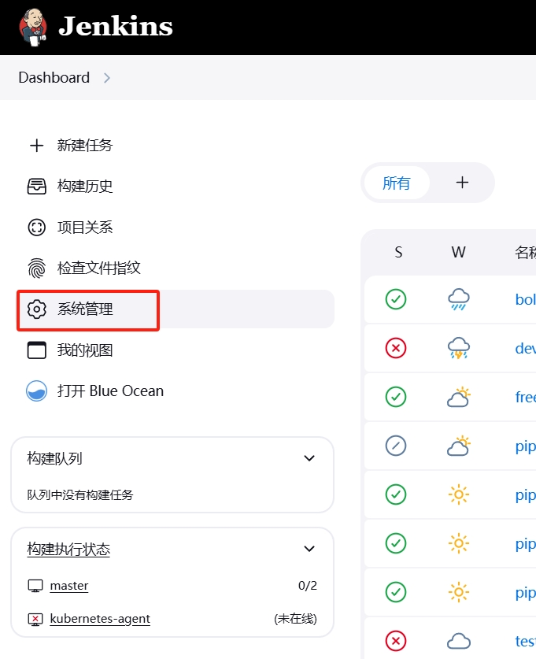
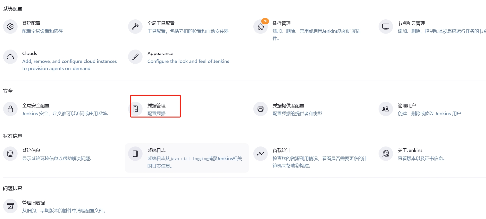
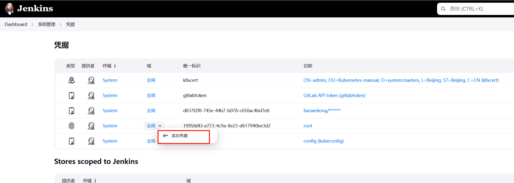
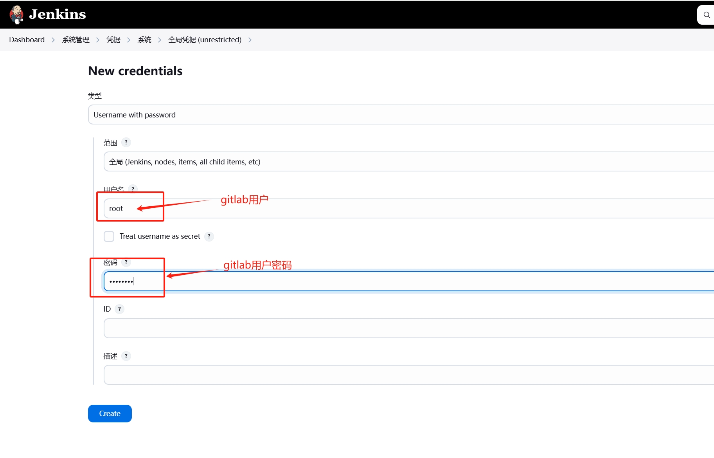
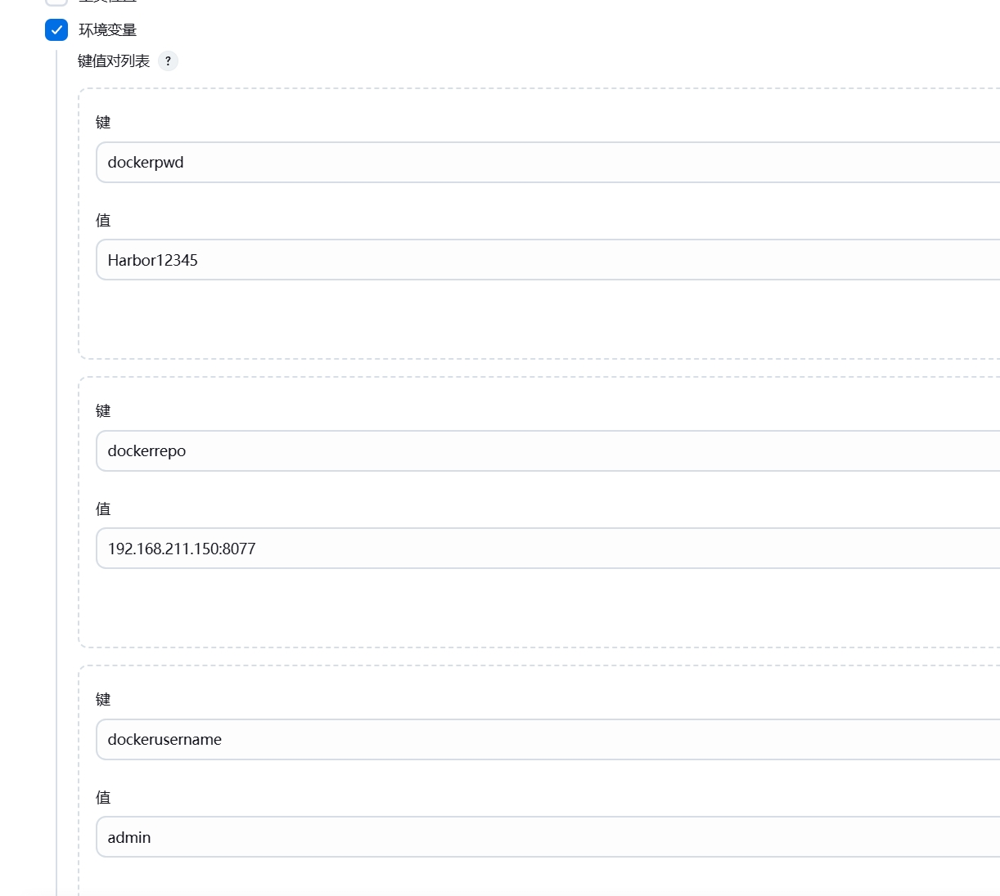

## 	CI/CD环境搭建之安装Jenkins


在/root下创建Jenkins文件夹

```shell
$ mkdir Jenkins && cd Jenkins
```
编辑docker-compose.yml文件

```shell
vim docker-compose.yml
```
修改配置如下：

```yaml
version: '3.8'
services:
  jenkins:
    image: 'jenkins/jenkins:lts'
    container_name: jenkins
    restart: always
    environment:
      - TZ=Asia/Shanghai
    user: root
    ports:
      - '8989:8080'
      - '50000:50000'
    volumes:
      - './jenkins_home:/var/jenkins_home'
      - '/var/run/docker.sock:/var/run/docker.sock'
      - '/usr/bin/docker:/usr/bin/docker'
      - /etc/docker/daemon.json:/etc/docker/daemon.json

```
执行docker-compose命令安装

```shell
$ docker-compose up -d
```


##### 在浏览器访问访问jenkins

在浏览器输入http://192.168.211.150:8989

等待Jenkins安装完毕


出现一下界面说明Jenkins准备完毕，在Jenkins安装路径jenkins_home/secrets/initialAdminPassword密码中找到密码并输入

安装推荐的插件


等待插件安装完成


创建root用户


安装完成




##### 添加凭证
凭证用于拉取gitlab仓库代码，这里使用gitlab账号和密码登录凭证，使用http的方式来拉取代码，使用ssh方式拉取代码需要配置“ssh username with private key“类型的凭证
二者可以任选一个






##### 添加harbor仓库配置
这里配置的环境变量将会在pipeline流水线中的脚本中使用到


到这里Jenkins初步安装部署完成，下一节我们将正式使用Jenkins、harbor、gitlab、k8s构建流水线部署rpc服务


​	


