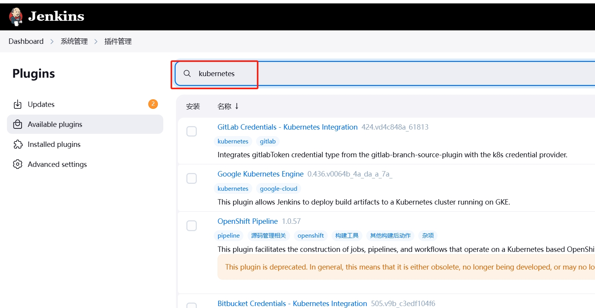

## 	Jenkins安装kubernetes插件

### jenkins动态slave

Jenkins可以使用静态节点(slave)和动态节点两种方式来构建任务，使用动态节点构建任务可以更好的利用资源，所谓动态节点构建任务就是在kubernetes集群里动态的创建一个pod,在这个pod里面跑我们写的pipeline脚本来构建任务，
构建任务完成后这个pod会自动销毁，静态slave这里不做介绍。

### Jenkins安装kubernetes插件

Jenkins使用kubernetes插件主要用于完成两方面的工作：一是用于在kubernetes集群内动态生成一个pod作为Jenkins 的slave节点，提供流水线执行的工作环境；二是用于将应用代码持续部署到kubernetes集群中，我们通过编写pipeline脚本集成kubernetes插件生成动态slave。


点击可用插件选项


搜索框输入kubernetes



选中kubernetes插件然后点击右上角的安装按钮等待安装完成。

### 配置Jenkins连接Kubernetes

jenkins与kubernetes的集成，主要是通过调用Kubernetes的API去kubernetes集群中进行工作的。大多数公司在安装kubernetes集群配置apiserver服务时使用了证书，所以在配置jenkins连接kubernetes集群时，需要根据kubernetes的配置文件生成一系列证书以及key，并将证书上传到Jenkins用来对apiserver进行认证。

#### 部署在非kubernetes集群内Jenkins连接kubernetes配置

安装好插件以后，进入Jenkins首页，点击菜单”Manage Jenkins(系统管理)-–> Clouds(云配置)” 在跳转到的界面中，到右上角，点击” new cloud（新建一个云）–> kubernetes“。

如下所示：


输入云的名称后点击create按钮跳转到填写详细信息页面，如下所示：


其中：

名称：这里用于填写要添加的这个云（cloud）的名称，默认为”kubernetes”，如果不想用这个可以自定义。在编写pipeline的时候会用到。

kubernetes 地址：用于填写kubernetes集群的地址，做了多master集群高可用的环境直接写vip地址加端口；只有单个master的环境直接写master加端口地址即可。

Kubernetes 服务证书 key：用于填写与kubernetes集群认证的证书内容。

Kubernetes 命名空间：用于填写调用kubernetes时生成的pod工作的namespace。

Credentials（凭据）：用于连接kubernetes的凭证。

Jenkins 地址：Jenkins的连接地址。

### Kubernetes服务证书key

kubernetes集群安装的时候生成了一系列证书以及key，并且在配置kubernetes中kubectl客户端命令权限的时候，根据这些证书以及key生成了一个kubeconfig文件，
用于kubectl与集群通信，这个文件默认为/root/.kube/config文件，对集群有最高操作权限（如果给了cluster-admin权限）。
Jenkins需要根据这个文件生成的证书与集群通信，所以我们在生产环境配置Jenkins连接kubernetes集群的时候，需要注意一下kubeconfig文件绑定的用户的权限，
最好从新生成一个低权限的kubeconfig文件，而不要用kubectl命令使用的文件。

### 配置证书

k8s config文件：
```shell
[root@master01 veyron]# cat /root/.kube/config
apiVersion: v1
clusters:
- cluster:
    certificate-authority-data: LS0tLS1CRUdJTiBDRVJUSUZJQ0FURS0tLS..............khLZlJVRG10TWxMTWNXZDJzd0RRWUpLb1pJaHZjTkFRRUwKQlFBd2R6RUxNQWtHQTFVRUJoTUNRMDR4RURBT0JnTlZCQWdUQjBKbGFXcHBibWN4RURBT0JnTlZCQWNUQjBKbAphV3BwYm1jeEV6QVJCZ05WQkFvVENrdDFZbVZ5Ym1WMFpYTXhHakFZQmdOVkJBc1RFVXQxWW1WeWJtVjBaWE10CmJXRnVkV0ZzTVJNd0VRWURWUVFERXdwcmRXSmxjbTVsZEdWek1DQVhEVEkxTURFd056QTJNVFl3TUZvWUR6SXgKTWpReE1qRTBNRFl4TmpBd1dqQjNNUXN3Q1FZRFZRUUdFd0pEVGpFUU1BNEdBMVVFQ0JNSFFtVnBhbWx1WnpFUQpNQTRHQTFVRUJ4TUhRbVZwYW1sdVp6RVRNQkVHQTFVRUNoTUtTM1ZpWlhKdVpYUmxjekVhTUJnR0ExVUVDeE1SClMzVmlaWEp1WlhSbGN5MXRZVzUxWVd3eEV6QVJCZ05WQkFNVENtdDFZbVZ5Ym1WMFpYTXdnZ0VpTUEwR0NTcUcKU0liM0RRRUJBUVVBQTRJQkR3QXdnZ0VLQW9JQkFRRGRPK3E2bTQrMEJ3ZU9VOW1NU2NaNlhhbkh6MjdSNk5LTwpnaURVZkhUbXYvNUVDQUE1M2wxdEFyZ2pWOGRjSktzWXVONDdJd29WekNCV1c5eDcxS3FiS2s5QTA1T1pmbDVKCi9IN3hZUlZUN3psS0VPMzRMRitKOFRzRDJEdVhrTkRSQjNxS3pWdFhBZ0JEU1ZZT0hRZEFJa3JKR3pmU3RaeVoKemhjMDVpVTZEclJOZnd0UlFtdzVYTEJLeDlKQllrN3kvVVdpVk5JcytaMm5GK3MrK0xSaGFkK25ueWpoQ0c0ZQpBdUdHMDFyTjhiUTRvQ1dqQkhQQmx1dXpiRTVVeEEyM1MrN0libS9kSE91Sy9lZUt2dFNZK0JqS1FXWWFFTm1zCkRURlZOYlYvU2JXc2hMY1gyOHI3NkgyNExydEVyeUcvdk9jWkZPanlmdHNLTG01WDJXSkRBZ01CQUFHalFqQkEKTUE0R0ExVWREd0VCL3dRRUF3SUJCakFQQmdOVkhSTUJBZjhFQlRBREFRSC9NQjBHQTFVZERnUVdCQlMweFNqWQo1NTNsU1R1N0F3Y3Byc2NNRElicWVEQU5CZ2txaGtpRzl3MEJBUXNGQUFPQ0FRRUFmZzZaSTNDelMveVpEWjYyCnJrRERFRUYyOWhKR2Z2aWtuclUrMHgvLzJXYjRhWGlNc3ZzRG96cTlidDN3K2ZBZm9vZmlHK3AvQ1RQa2p3L2QKYUpJbmhlc05MSCtocTF2OXVrc1dORnQwNzdsdHdad05XSlZiQyttbXRSLzVXRDRoU3pZd2lSM1k3allrV0pOMwpKRU5NTzNFTm82MVBvL2Q2WStaU0tQM3h3R2JwTjZGWHh2MkZoblR4Zmg2d1BVa21tQjhyb3E2YXphNWhCQkRICnl6NUpMMmhXcUp6TGNpVUlKUkx5MVVMTXJBaDVYWjJsYW9sZVdLWWZMSFpvcHAwUFY2L3N5ejZIRm9nOTFIcUYKQjN6bWhBbkxvS0U4Z1FTRHBiTnRaMkViTGpoWlVzRW5zZ2xjMDc5OTRDV1lsRGhreEVid1Vjd25YT0ZrZ24vLwpCaFZza3c9PQotLS0tLUVORCBDRVJUSUZJQ0FURS0tLS0tCg==
    server: https://127.0.0.1:8443
  name: kubernetes
contexts:
- context:
    cluster: kubernetes
    user: kubernetes-admin
  name: kubernetes-admin@kubernetes
current-context: kubernetes-admin@kubernetes
kind: Config
preferences: {}
users:
- name: kubernetes-admin
  user:
    client-certificate-data: LS0tLS1CRUdJTiBDRVJUSUZJQ...................xdjZJd0RRWUpLb1pJaHZjTkFRRUwKQlFBd2R6RUxNBbWBKbAphV305WQkFvVENrdDFZbVZ5Ym1WMFpYTXhHakFZQmdOVkJBc1RFVXQxWW1WeWJtVjBaWE10CmJXRnVkV0ZzTVJNd0VRWURWUVFERXdwcmRXSmxjbTVsZEdWek1DQVhEVEkxTURFd056QTJNall3TUZvWUR6SXgKTWpReE1qRTBNRFl5TmpBd1dqQjJNUXN3Q1FZRFZRUUdFd0pEVGpFUU1BNEdBMVVFQ0JNSFFtVnBhbWx1WnpFUQpNQTRHQTFVRUJ4TUhRbVZwYW1sdVp6RVhNQlVHQTFVRUNoTU9jM2x6ZEdWdE9tMWhjM1JsY25NeEdqQVlCZ05WCkJBc1RFVXQxWW1WeWJtVjBaWE10YldGdWRXRnNNUTR3REFZRFZRUURFd1ZoWkcxcGJqQ0NBU0l3RFFZSktvWkkKaHZjTkFRRUJCUUFEZ2dFUEFEQ0NBUW9DZ2dFQkFMTDBUcXNEVmVYUEkwQ1JoRFc4NVlkWjBLUWZTNWtRSzB5NAp2SFRIQzBZTWJTaHFna2tSUk5LRGNBSXB5Q0MvQ1ltYzU0Vmx4WnNEdExNcGpoUHBwVUxXMDFmbjN4NG5BZVNYCkFhaDlGSWlrSCs2bHkxL0U4bi9VY3JkMTJEdkEyM0RWMDFnMGxOZysvM3owbVVYV0dzbFFmczFHYlFQa2JjVVAKZmZjVUZoVWxwekVvK3NRZjgwQU1mRmFrOUpCek0zeXBic3Fsd2VKRitTTTZVdHBoVmZrWEVLeGQ2SUhyZTIvMApiRjBIMEYyeGt5empwdjBwdDFmbEZ3Vm0wWjM0Rm9wOVJLN21VakZSdHNCTXA2eTdFbUdydmpJcDZPSDVzWHYzClhxdzVlVlBTTUlycUhEc05wNFVMekpnSXpPZ0RhN2IvTGExWSt5TkZGKzZHSENVVjlVVUNBd0VBQWFOL01IMHcKRGdZRFZSMFBBUUgvQkFRREFnV2dNQjBHQTFVZEpRUVdNQlFHQ0NzR0FRVUZCd01CQmdnckJnRUZCUWNEQWpBTQpCZ05WSFJNQkFmOEVBakFBTUIwR0ExVWREZ1FXQkJUYTZjQUhaWXZvV084UXdld0dBd0JoUmdHTnh6QWZCZ05WCkhTTUVHREFXZ0JTMHhTalk1NTNsU1R1N0F3Y3Byc2NNRElicWVEQU5CZ2txaGtpRzl3MEJBUXNGQUFPQ0FRRUEKSVZuK2lubnREQzNQdVhTVWVTdHRibU5QM3lzRVhMUEFpd2lIZ1dDdm5KQzRDRTlwUlpPQ1JQcGVHZU9lNlVBbgpoL0tGSXVQamlNU3gyWlo5SWtQb3VDSVRLMVR5Y2FGdDRtMXpZWE5LdjBvQmZGK21KdmpVMFVROWdlM2xZQkFHClhrN0c5dTNXck56azF3aHFxOXFMVTFzNG9kR3M3Z2VSNWRXOHNpT1d0TGxLRlpEK2NoaGUwYUR3QlZhZnNlNHkKejU2Z1ZYS1JxMzhQOEdSSG15NkxuR3BYeUdtVHp4cURIWlVKM1d0UE5jN1NQU2MyYTBrblJReVozdlZhNjc1OAo2S1NOMzJPSGVabk5iaGNia2JwZ2xUaENqVXh3RGNOQzQ3ZFY5V1djc1VZbXBmd3NmeEVGTjJPdEhIMHBLV0tiCjFIdWJFNU92ODEyZm9VeWpGMFZWRlE9PQotLS0tLUVORCBDRVJUSUZJQ0FURS0tLS0tCg==
    client-key-data: LS0tLS1CRUdJTiBSU0EgUFJJVk...............b2dJQkFBS0NBUUVBc3ZST3F3TlY1YzhqUUpHRU5iemxoMW5RcEI5TG1SQXJUTGk4ZE1jTFJneHRLR3FDClNSRkUwb053QWluSUlMOEppWnpuaFdYRm13TzBzeW1PRSttbFF0YlRWK2ZmSGljQjVKY0JxSDBVaUtRZjdxWEwKWDhUeWY5Unl0M1hZTzhEYmNOWFRXRFNVMkQ3L2ZQU1pSZFlheVZCK3pVWnRBK1J0eFE5OTl4UVdGU1duTVNqNgp4Qi96UUF4OFZxVDBrSE16ZktsdXlxWEI0a1g1SXpwUzJtRlYrUmNRckYzb2dldDdiL1JzWFFmUVhiR1RMT09tCi9TbTNWK1VYQldiUm5mZ1dpbjFFcnVaU01WRzJ3RXluckxzU1lhdStNaW5vNGZteGUvZGVyRGw1VTlJd2l1b2MKT3cybmhRdk1tQWpNNkFOcnR2OHRyVmo3STBVWDdvWWNKUlgxUlFJREFRQUJBb0lCQUMyMzJvMDRHZTdQSDN0MApjYWxrNitMTFlGRTlxWXVlSk9IQjVHdVZHbDAzK1g4MHpyb3FEa0lWMER6TlBkS1gyN0RyZy82QmhKMVlzZ1ovCm5FdWNDbHRzRkt4RmthdmJYVkZ2L3Ixenp4WWxqLzdoSG5jR0VzbnpsYWNuRlNvVzJEa1lkNWoyUGZ5TkE2cUIKdHRLdm8wSkJMVlAySlEyMGd4S3dKWWRFKzJ0Rk9ORjYrdHoxVVlnNTFyeEV2VXBtcVJhdDhGQXlyRGRGZTBHOApVTmU3NEVDdFY3TXdJUSttaG5zMHNOT1RaZ2V0ZFdKMDRxOFhnYW5tQXQ3QUhwek5yeUkveUZHNlVINlAzOGpHCkRrSkVITjVCS1lQYnJHc0c2Qm41NHhESnVXZ0xYSUVJT0tZTnNHTzB6TlZXSnFPb1ZLbkIvOVpPNGVVMTlhTXYKQ081Zkg2RUNnWUVBeXpFLytCcloyaVM4cHVUSWdCZzdzMXNYNGpqUTVGM3BYYzZ0YnpGZEF1S3JpZytOWXNNZApMQlkzdXlpMm42Y29aWUJWYlFGdTlSMkFOREEwZnBBMVlqUE1obGpYTDVyWlVlalNzWW9WN0N2M2RWa0hobm91CnI0ZjdoNVZCMXZ2Lzh5U3VYSFFxNy9wUmZCa0tQNVlyMXBEVDk1THcwMHd1dnRoZkJ4OFd3VDBDZ1lFQTRYWjAKMk9QVTVoOGc4S1RjZWh3RTNqQ1pJZzdBTThURWlqZXNrNW5tUDlnbWNLSDhNN3U1UU8rcS9HVjRrV2ZZbjhqTwpxK3l1YUh3dE1EQTd0UGpQQzE3RHlUN1M3Mkl3TUhxYmlhblJiVTF5K0NXNzgrRDU4aVVnT3N6enArR3QzelVFCjZLeGlCNS91blBsenRFUWtqQ1JXMHhTaHJHTTA4Zzk5d2x3UU5La0NnWUFxVnVEVmVnTGJDYnlscWhaOVdvOVcKR0MwcDNsem91UWpmbXlsWWVoaS9lU3YxWUxnOVZCcklEUGtmN3FQZk1KMmlTTk9FRzBCYm93SUwzZCtTWDhvLwo1RHRCNDFFemdqaTJjS1UyaVdkNEJ0RlJpbk9lK2Vhd2ZNMVV1eTAwOXQybWRJWkFqWlJFM1F3TnA4b1M1ZC9NCm5mRU5MWGt4RGpiUFhaYXZqVExZb1FLQmdFdnREbEJ6K1NBOTMyUHF3T3pHUHNWc2JFVlIzbHdRcVhjNlpIMlkKV0RlcjNOWVZWczg5S3BlNW5rVTlEcXM0NDNSN3RVMmtlTjlxNGZUV2FXVDZYUThoTEtHNjdHSDlHT2xhZ01LTgpVNStSYzJRcG9PL3lGWG44RXF4NmxKczJuczBLRjhzYk1qQUxKZG5yRDVIbldMOXhCV1EwRUhYek9zTkJnRUpSCnFvdHhBb0dBQ1ZpUnFRUUlHcmVFazdXeEFFQTlHaGUrWUd3L0hiSmZVZW42Y2FvWHNVSERvMFVZSzlVNlFBZDgKQ1U0MGlXR3g3MmNpcHNQWkpaZUdRNXlnSHFMZFRTWm5mV0NPWGpWS3lIRjFNRUV0UVdxK2pheHVZSUM4TG9xYQo2b21QWmNXb0d1RFRuU3Ivdm9GcVhUNWNuSnBsVWRXTzczQVp3ajRRTWp5a2tOQWZwMkE9Ci0tLS0tRU5EIFJTQSBQUklWQVRFIEtFWS0tLS0tCg==

```
获取config文件中certificate-authority-data的内容并转化成base64 encoded文件

```shell
echo LS0tLS1CRUdJTiBDRVJUSUZJQ0FURS0tLS...............d0RRWUpLb1pJaHZjTkFRRUwKQlFBd2R6RUxNQWtHQTFVRUJoTUNRMDR4RURBT0JnTlZCQWdUQjBKbGFXcHBibWN4RURBT0JnTlZCQWNUQjBKbAphV3BwYm1jeEV6QVJCZ05WQkFvVENrdDFZbVZ5Ym1WMFpYTXhHakFZQmdOVkJBc1RFVXQxWW1WeWJtVjBaWE10CmJXRnVkV0ZzTVJNd0VRWURWUVFERXdwcmRXSmxjbTVsZEdWek1DQVhEVEkxTURFd056QTJNVFl3TUZvWUR6SXgKTWpReE1qRTBNRFl4TmpBd1dqQjNNUXN3Q1FZRFZRUUdFd0pEVGpFUU1BNEdBMVVFQ0JNSFFtVnBhbWx1WnpFUQpNQTRHQTFVRUJ4TUhRbVZwYW1sdVp6RVRNQkVHQTFVRUNoTUtTM1ZpWlhKdVpYUmxjekVhTUJnR0ExVUVDeE1SClMzVmlaWEp1WlhSbGN5MXRZVzUxWVd3eEV6QVJCZ05WQkFNVENtdDFZbVZ5Ym1WMFpYTXdnZ0VpTUEwR0NTcUcKU0liM0RRRUJBUVVBQTRJQkR3QXdnZ0VLQW9JQkFRRGRPK3E2bTQrMEJ3ZU9VOW1NU2NaNlhhbkh6MjdSNk5LTwpnaURVZkhUbXYvNUVDQUE1M2wxdEFyZ2pWOGRjSktzWXVONDdJd29WekNCV1c5eDcxS3FiS2s5QTA1T1pmbDVKCi9IN3hZUlZUN3psS0VPMzRMRitKOFRzRDJEdVhrTkRSQjNxS3pWdFhBZ0JEU1ZZT0hRZEFJa3JKR3pmU3RaeVoKemhjMDVpVTZEclJOZnd0UlFtdzVYTEJLeDlKQllrN3kvVVdpVk5JcytaMm5GK3MrK0xSaGFkK25ueWpoQ0c0ZQpBdUdHMDFyTjhiUTRvQ1dqQkhQQmx1dXpiRTVVeEEyM1MrN0libS9kSE91Sy9lZUt2dFNZK0JqS1FXWWFFTm1zCkRURlZOYlYvU2JXc2hMY1gyOHI3NkgyNExydEVyeUcvdk9jWkZPanlmdHNLTG01WDJXSkRBZ01CQUFHalFqQkEKTUE0R0ExVWREd0VCL3dRRUF3SUJCakFQQmdOVkhSTUJBZjhFQlRBREFRSC9NQjBHQTFVZERnUVdCQlMweFNqWQo1NTNsU1R1N0F3Y3Byc2NNRElicWVEQU5CZ2txaGtpRzl3MEJBUXNGQUFPQ0FRRUFmZzZaSTNDelMveVpEWjYyCnJrRERFRUYyOWhKR2Z2aWtuclUrMHgvLzJXYjRhWGlNc3ZzRG96cTlidDN3K2ZBZm9vZmlHK3AvQ1RQa2p3L2QKYUpJbmhlc05MSCtocTF2OXVrc1dORnQwNzdsdHdad05XSlZiQyttbXRSLzVXRDRoU3pZd2lSM1k3allrV0pOMwpKRU5NTzNFTm82MVBvL2Q2WStaU0tQM3h3R2JwTjZGWHh2MkZoblR4Zmg2d1BVa21tQjhyb3E2YXphNWhCQkRICnl6NUpMMmhXcUp6TGNpVUlKUkx5MVVMTXJBaDVYWjJsYW9sZVdLWWZMSFpvcHAwUFY2L3N5ejZIRm9nOTFIcUYKQjN6bWhBbkxvS0U4Z1FTRHBiTnRaMkViTGpoWlVzRW5zZ2xjMDc5OTRDV1lsRGhreEVid1Vjd25YT0ZrZ24vLwpCaFZza3c9PQotLS0tLUVORCBDRVJUSUZJQ0FURS0tLS0tCg== |base64 -d > ca.crt
```
将ca.crt的内容粘贴到Kubernetes服务证书key框里，如下图所示：


### 配置凭据

获取/root/.kube/config文件中client-certificate-data和client-key-data的内容并转化成base64 encoded文件
```shell
echo LS0tLS1CRUdJTiBDRVJUSUZJQ...................xdjZJd0RRWUpLb1pJaHVkJBc1RFVURWUVFERXdwcmRXSmxjbTVsZEdWek1DQVhEVEkxTURFd056QTJNall3TUZvWUR6SXgKTWpReE1qRTBNRFl5TmpBd1dqQjJNUXN3Q1FZRFZRUUdFd0pEVGpFUU1BNEdBMVVFQ0JNSFFtVnBhbWx1WnpFUQpNQTRHQTFVRUJ4TUhRbVZwYW1sdVp6RVhNQlVHQTFVRUNoTU9jM2x6ZEdWdE9tMWhjM1JsY25NeEdqQVlCZ05WCkJBc1RFVXQxWW1WeWJtVjBaWE10YldGdWRXRnNNUTR3REFZRFZRUURFd1ZoWkcxcGJqQ0NBU0l3RFFZSktvWkkKaHZjTkFRRUJCUUFEZ2dFUEFEQ0NBUW9DZ2dFQkFMTDBUcXNEVmVYUEkwQ1JoRFc4NVlkWjBLUWZTNWtRSzB5NAp2SFRIQzBZTWJTaHFna2tSUk5LRGNBSXB5Q0MvQ1ltYzU0Vmx4WnNEdExNcGpoUHBwVUxXMDFmbjN4NG5BZVNYCkFhaDlGSWlrSCs2bHkxL0U4bi9VY3JkMTJEdkEyM0RWMDFnMGxOZysvM3owbVVYV0dzbFFmczFHYlFQa2JjVVAKZmZjVUZoVWxwekVvK3NRZjgwQU1mRmFrOUpCek0zeXBic3Fsd2VKRitTTTZVdHBoVmZrWEVLeGQ2SUhyZTIvMApiRjBIMEYyeGt5empwdjBwdDFmbEZ3Vm0wWjM0Rm9wOVJLN21VakZSdHNCTXA2eTdFbUdydmpJcDZPSDVzWHYzClhxdzVlVlBTTUlycUhEc05wNFVMekpnSXpPZ0RhN2IvTGExWSt5TkZGKzZHSENVVjlVVUNBd0VBQWFOL01IMHcKRGdZRFZSMFBBUUgvQkFRREFnV2dNQjBHQTFVZEpRUVdNQlFHQ0NzR0FRVUZCd01CQmdnckJnRUZCUWNEQWpBTQpCZ05WSFJNQkFmOEVBakFBTUIwR0ExVWREZ1FXQkJUYTZjQUhaWXZvV084UXdld0dBd0JoUmdHTnh6QWZCZ05WCkhTTUVHREFXZ0JTMHhTalk1NTNsU1R1N0F3Y3Byc2NNRElicWVEQU5CZ2txaGtpRzl3MEJBUXNGQUFPQ0FRRUEKSVZuK2lubnREQzNQdVhTVWVTdHRibU5QM3lzRVhMUEFpd2lIZ1dDdm5KQzRDRTlwUlpPQ1JQcGVHZU9lNlVBbgpoL0tGSXVQamlNU3gyWlo5SWtQb3VDSVRLMVR5Y2FGdDRtMXpZWE5LdjBvQmZGK21KdmpVMFVROWdlM2xZQkFHClhrN0c5dTNXck56azF3aHFxOXFMVTFzNG9kR3M3Z2VSNWRXOHNpT1d0TGxLRlpEK2NoaGUwYUR3QlZhZnNlNHkKejU2Z1ZYS1JxMzhQOEdSSG15NkxuR3BYeUdtVHp4cURIWlVKM1d0UE5jN1NQU2MyYTBrblJReVozdlZhNjc1OAo2S1NOMzJPSGVabk5iaGNia2JwZ2xUaENqVXh3RGNOQzQ3ZFY5V1djc1VZbXBmd3NmeEVGTjJPdEhIMHBLV0tiCjFIdWJFNU92ODEyZm9VeWpGMFZWRlE9PQotLS0tLUVORCBDRVJUSUZJQ0FURS0tLS0tCg== |base64 -d >client.crt

//生成key
echo LS0tLS1CRUdJTiBSU0EgUFJJVk...............b2dJQkFBS0NBUUVBc3ZST3F3TlY1YzhqUUpHRU5ieWluSUlKY0JxSUUF4m9tCi9TbTNWK1VYQldiUm5mZ1dpbjFFcnVaU01WRzJ3RXluckxzU1lhdStNaW5vNGZteGUvZGVyRGw1VTlJd2l1b2MKT3cybmhRdk1tQWpNNkFOcnR2OHRyVmo3STBVWDdvWWNKUlgxUlFJREFRQUJBb0lCQUMyMzJvMDRHZTdQSDN0MApjYWxrNitMTFlGRTlxWXVlSk9IQjVHdVZHbDAzK1g4MHpyb3FEa0lWMER6TlBkS1gyN0RyZy82QmhKMVlzZ1ovCm5FdWNDbHRzRkt4RmthdmJYVkZ2L3Ixenp4WWxqLzdoSG5jR0VzbnpsYWNuRlNvVzJEa1lkNWoyUGZ5TkE2cUIKdHRLdm8wSkJMVlAySlEyMGd4S3dKWWRFKzJ0Rk9ORjYrdHoxVVlnNTFyeEV2VXBtcVJhdDhGQXlyRGRGZTBHOApVTmU3NEVDdFY3TXdJUSttaG5zMHNOT1RaZ2V0ZFdKMDRxOFhnYW5tQXQ3QUhwek5yeUkveUZHNlVINlAzOGpHCkRrSkVITjVCS1lQYnJHc0c2Qm41NHhESnVXZ0xYSUVJT0tZTnNHTzB6TlZXSnFPb1ZLbkIvOVpPNGVVMTlhTXYKQ081Zkg2RUNnWUVBeXpFLytCcloyaVM4cHVUSWdCZzdzMXNYNGpqUTVGM3BYYzZ0YnpGZEF1S3JpZytOWXNNZApMQlkzdXlpMm42Y29aWUJWYlFGdTlSMkFOREEwZnBBMVlqUE1obGpYTDVyWlVlalNzWW9WN0N2M2RWa0hobm91CnI0ZjdoNVZCMXZ2Lzh5U3VYSFFxNy9wUmZCa0tQNVlyMXBEVDk1THcwMHd1dnRoZkJ4OFd3VDBDZ1lFQTRYWjAKMk9QVTVoOGc4S1RjZWh3RTNqQ1pJZzdBTThURWlqZXNrNW5tUDlnbWNLSDhNN3U1UU8rcS9HVjRrV2ZZbjhqTwpxK3l1YUh3dE1EQTd0UGpQQzE3RHlUN1M3Mkl3TUhxYmlhblJiVTF5K0NXNzgrRDU4aVVnT3N6enArR3QzelVFCjZLeGlCNS91blBsenRFUWtqQ1JXMHhTaHJHTTA4Zzk5d2x3UU5La0NnWUFxVnVEVmVnTGJDYnlscWhaOVdvOVcKR0MwcDNsem91UWpmbXlsWWVoaS9lU3YxWUxnOVZCcklEUGtmN3FQZk1KMmlTTk9FRzBCYm93SUwzZCtTWDhvLwo1RHRCNDFFemdqaTJjS1UyaVdkNEJ0RlJpbk9lK2Vhd2ZNMVV1eTAwOXQybWRJWkFqWlJFM1F3TnA4b1M1ZC9NCm5mRU5MWGt4RGpiUFhaYXZqVExZb1FLQmdFdnREbEJ6K1NBOTMyUHF3T3pHUHNWc2JFVlIzbHdRcVhjNlpIMlkKV0RlcjNOWVZWczg5S3BlNW5rVTlEcXM0NDNSN3RVMmtlTjlxNGZUV2FXVDZYUThoTEtHNjdHSDlHT2xhZ01LTgpVNStSYzJRcG9PL3lGWG44RXF4NmxKczJuczBLRjhzYk1qQUxKZG5yRDVIbldMOXhCV1EwRUhYek9zTkJnRUpSCnFvdHhBb0dBQ1ZpUnFRUUlHcmVFazdXeEFFQTlHaGUrWUd3L0hiSmZVZW42Y2FvWHNVSERvMFVZSzlVNlFBZDgKQ1U0MGlXR3g3MmNpcHNQWkpaZUdRNXlnSHFMZFRTWm5mV0NPWGpWS3lIRjFNRUV0UVdxK2pheHVZSUM4TG9xYQo2b21QWmNXb0d1RFRuU3Ivdm9GcVhUNWNuSnBsVWRXTzczQVp3ajRRTWp5a2tOQWZwMkE9Ci0tLS0tRU5EIFJTQSBQUklWQVRFIEtFWS0tLS0tCg== | base64 -d >client.key
```
生成Client P12认证文件cert.pfx，并下载至本地

```shell
openssl pkcs12 -export -out cert.pfx -inkey client.key -in client.crt -certfile ca.crt
Enter Export Password:　　　　　　　　　　　　//记住密码，jenkins导入证书的时候需要用到
Verifying - Enter Export Password:
```

### 在Jenkins添加连接K8s集群的凭证

点击菜单”Manage Jenkins(系统管理)-–> 凭证管理


添加全局凭证


类型选择certificate,证书类型选择Upload PKCS#12 certificate and key,选择生成好的ca.crt证书，输入生成证书时的密码，点击创建按钮创建


### 在新增的k8s云里配置凭证并测试连接是否成功

选择添加的凭证


点击测试按钮成功连接到k8s集群，如下所示：


到此，部署在非kubernetes集群内的Jenkins连接kubernetes配置就完成了。


​	


