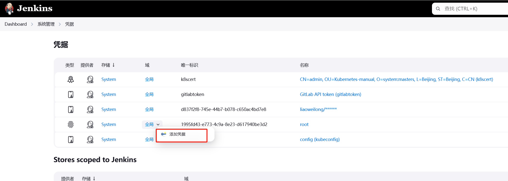
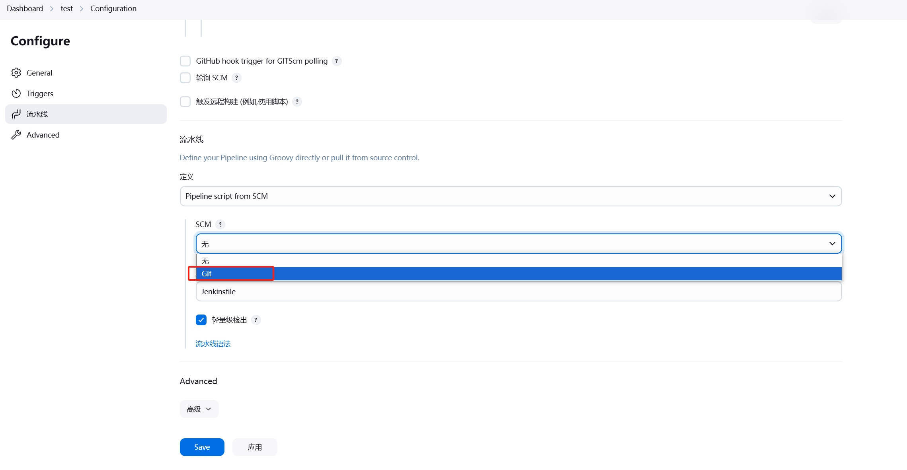

## 	创建pipeline script from SCM实现提交代码触发构建任务

### jenkins创建用于拉取代码的凭证

进入Jenkins首页，点击菜单”Manage Jenkins(系统管理)-–>凭证管理



填写gitlab的用户名和密码，点击保存


### jenkins创建scm
回到Jenkins系统首页，点击“新建任务”


输入scm名称并选择“流水线”类型，如果没有流水线选项则需要先安装插件“pipeline”，点击创建按钮跳转到填写详细信息页面


在Triggers选项里勾选如下：


下拉找到“高级”选项，点开


点检“generate”生成token,token用于配置gitlab的webhook,以实现触发Jenkins构建任务


继续往下拉到“流水线”选项，选择pipeline script from scm


scm选项选择git，如果没有git选项需要先安装“git”插件



repository填写gitlab项目的地址，credentials选择新建的拉取代码的凭证


选择分支和填写Jenkinsfile的路径（gitlab项目中的绝对路径），点击“save”按钮完成Jenkins端的设置


### 设置gitlabwebhook

登录gitlab并进入到项目页面


点击左侧的setting->webhook->add new webhook


填写url和secret token


将jenkins scm trigger选项中配置的“Build when a change is pushed to GitLab. GitLab webhook URL: http://192.168.211.150:8989/project/bolog-rpc”的地址复制到上面gitlab webhook的url中


​	
将jenkins scm trigger选项中“高级”配置的token复制到上面gitlab webhook的secret token中


点击“save”按钮创建成功

### 验证是否能触发Jenkinsfile构建任务

在gitlab测试是否能自动触发pipeline流水线


返回“Hook executed successfully: HTTP 200“表示自动触发了流水线构建任务


提交jenkinsfile验证自动触发了流水线构建任务

编写Jenkinsfile

```shell
pipeline{
    agent{
        kubernetes{
            label 'test01'
            cloud 'veyron-k8s'
            yaml '''
---
kind: Pod
apiVersion: v1
metadata:
  labels:
    k8s-app: jenkins-agent
  name: jenkins-agent
  namespace: jenkins
spec:
containers:
  - name: jenkinsagent
    image: jenkins/inbound-agent
    imagePullPolicy: IfNotPresent
'''
        }
    }

    stages{
        stage("Hello"){
          steps{
            script{
              echo "Hello Slave Pod on Kubernetes!"
            }
            script{
              sh "sleep 30"
            }
          }
        }
    }
}
```
使用git命令提交jenkinsfile到gitlab项目代码仓库中

查看Jenkins构建任务


虽然构建任务失败了，但是成功自动触发了构建任务。

下一章将使用pipeline实现go-zero微服务的cicd。


