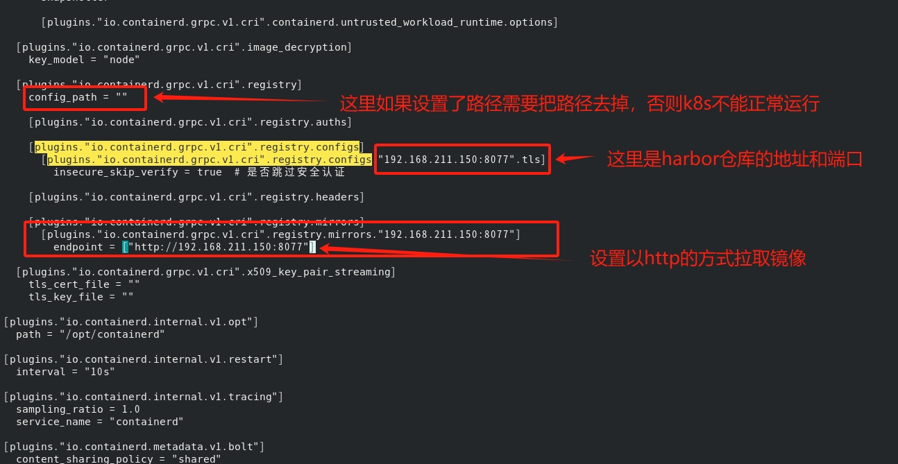
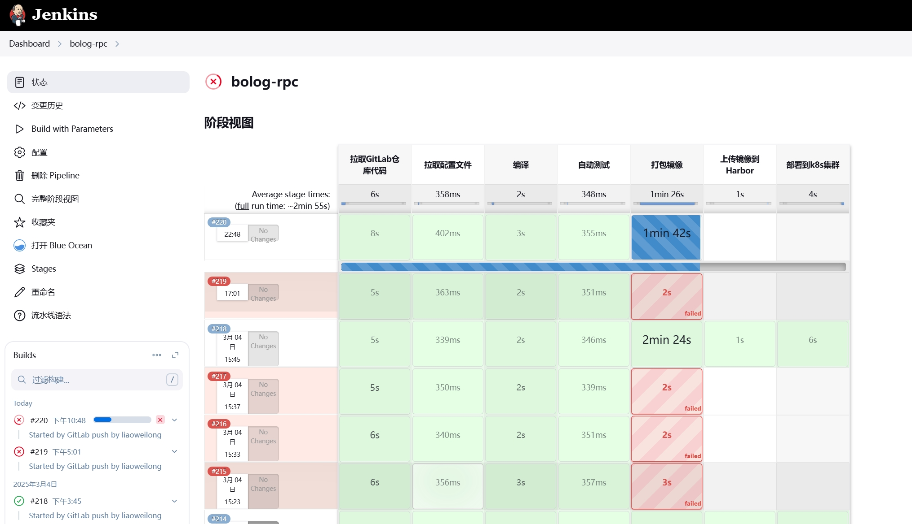
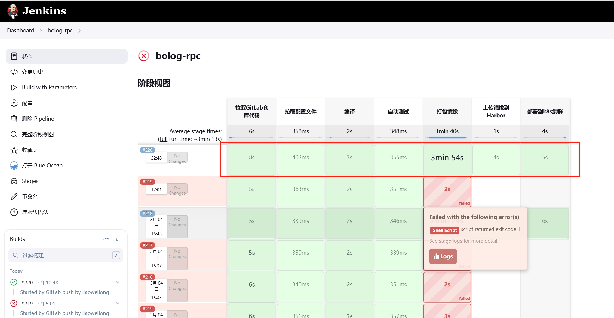
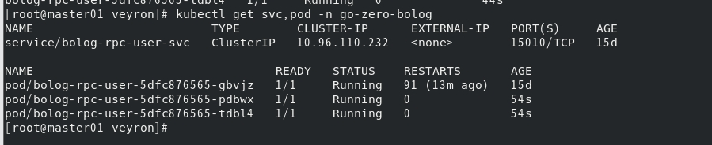

## 	使用脚本式语法编写pipeline构建go-zero微服务发布任务

### 配置kubernetes从harbor镜像仓库拉取镜像

由于我使用的是基于containerd运行时的kubernetes，所以在开始写pipeline之前先要设置好containerd配置文件，让k8s集群可以从harbor镜像库拉取到镜像文件

修改/etc/containerd/config.toml

```shell
$ vim /etc/containerd/config.toml
```
在 plugins."io.containerd.grpc.v1.cri".registry.configs 节点和 plugins."io.containerd.grpc.v1.cri".registry.mirrors 节点下增加相应配置，如下所示：



每个k8s节点都要设置，配置生效并重启Containerd

```shell
$ systemctl daemon-reload && systemctl restart containerd.service
```

由于是设置了使用http方式拉取镜像，所以还要设置vim /etc/docker/daemon.json文件，增加 insecure-registries 选项，如下所示

```shell
{
  "exec-opts":["native.cgroupdriver=systemd"],
  "registry-mirrors":["https://akchsmlh.mirror.aliyuncs.com"],
  "insecure-registries": ["192.168.211.150:8077"] ##私有仓库ip:端口
}
```
重启容器

```shell
sudo systemctl daemon-reload  
sudo systemctl restart docker
```

###  编辑k8s节点上的/var/run/docker.sock权限

由于pipeline中的container容器挂载了k8s节点上的docker，当Jenkins slave在k8s集群中以pod的形式运行并开始构建任务时需要用到docker，会调用k8s集群节点上的docker，比如当生成镜像后要推送到harbor镜像仓库的时候需要使用docker login命令，这时候会出现权限不足的情况导致pipeline构建任务失败，目前我的办法是给k8s集群节点上的/var/run/docker.sock文件加上777权限，也就是docker权限组以外的用户拥有和docker权限组一样的权限，当然这只是权宜之计，日后有时间会研究有没有其它方法解决这个问题

jenkins错误

```shell
permission denied while trying to connect to the Docker daemon socket at unix:///var/run/docker.sock: Post "http://%2Fvar%2Frun%2Fdocker.sock/v1.45/build?buildargs=%7B%7D&cachefrom=%5B%5D&cgroupparent=&cpuperiod=0&cpuquota=0&cpusetcpus=&cpusetmems=&cpushares=0&dockerfile=Dockerfile&labels=%7B%7D&memory=0&memswap=0&networkmode=default&rm=1&shmsize=0&t=bolog-rpc-user%3A57c2bf8&target=&ulimits=%5B%5D&version=1": dial unix /var/run/docker.sock: connect: permission denied
```

在每个k8s节点上执行命令：

```shell
$ chmod 777  /var/run/docker.sock
```
### 编写pipeline脚本

```shell
def POD_LABEL = "jenkinspod-${UUID.randomUUID().toString()}"
podTemplate(label: POD_LABEL, cloud: 'veyron-k8s', containers: [
    containerTemplate(
    name: 'jnlp', 
    image:'jenkins/inbound-agent', 
    args: '${computer.jnlpmac} ${computer.name}',
    ttyEnabled: true,
    privileged: true,
    alwaysPullImage: false),
    containerTemplate(name: 'goctl', image: 'kevinwan/goctl', ttyEnabled: true, command: 'cat',alwaysPullImage: false),
    containerTemplate(name: 'kubectl',image: 'cnych/kubectl', ttyEnabled: true,command: 'cat',alwaysPullImage: false)
  ],volumes: [
        hostPathVolume(hostPath: '/usr/bin/docker', mountPath:'/usr/bin/docker'),
        hostPathVolume(hostPath: '/var/run/docker.sock', mountPath:'/var/run/docker.sock'),
        hostPathVolume(hostPath: '/etc/docker/daemon.json', mountPath:'/etc/docker/daemon.json')
    ]) {
    node(POD_LABEL) {
        stage('拉取GitLab仓库代码') {
            checkout scmGit(branches: [[name: '*/main']], extensions: [], userRemoteConfigs: [[credentialsId: 'd837f2f8-745e-44b7-b078-c650ac4bd7e8', url: 'http://192.168.211.150/liaoweilong/go-zero-bolog.git']])
            env.commit_id = sh(returnStdout: true, script: 'git rev-parse --short HEAD').trim()
            sh 'echo ${commit_id}'
            sh 'echo 构建服务类型：${JOB_NAME}-$service'
        }
        stage('拉取配置文件') {
            sh 'echo 开始测试'
        }
        stage('编译') {
            container('goctl') {
                sh 'echo goctl版本检测'
                sh 'goctl --version'
                sh 'rm User/Rpc/Dockerfile -rf'
                sh 'echo 使用goctl生成dockerfile'
                sh 'cd User/Rpc/ && goctl docker -go ${service}.go && ls -l'
            }
       }
       stage('自动测试') {
            sh 'echo 开始测试'
       }
       stage('打包镜像') {
            container('jnlp') {
                sh 'echo docker --version'
                sh 'docker --version'
                sh 'cat /etc/docker/daemon.json'
                env.image = sh(returnStdout: true, script: 'echo ${JOB_NAME}-${service}:${commit_id}').trim()
                sh 'echo 镜像名称：${image} && cp User/Rpc/Dockerfile ./  && ls -l && docker build  -t ${image} .'
            }    
       }
       stage('上传镜像到Harbor') {
            echo "上传到镜像仓库"
            sh 'docker login --username=${dockerusername} --password=${dockerpwd} http://${dockerrepo}'
            sh 'docker tag  ${image} ${dockerrepo}/go-zero-bolog/${image}'
            sh 'docker push ${dockerrepo}/go-zero-bolog/${image}'
       }
       stage('部署到k8s集群') {
            container('goctl'){
                echo "goctl生成yaml部署文件"
                env.deployYaml = sh(returnStdout: true, script: 'echo ${JOB_NAME}-${service}-deploy.yaml').trim()
                env.port='15010'
                sh 'echo ${port}'
                sh 'rm -f ${deployYaml}'
                sh 'goctl kube deploy -replicas 1 -requestCpu 200 -requestMem 50 -limitCpu 300 -limitMem 100 -name ${JOB_NAME}-${service} -namespace go-zero-bolog -image ${dockerrepo}/go-zero-bolog/${image} -o ${deployYaml} -port ${port} -serviceAccount find-endpoints '
                sh "sed -i 's/v2beta2/v2/g' ${deployYaml}"
            }
            container('kubectl') {
                withKubeConfig(caCertificate: '', clusterName: 'kubernetes', contextName: '', credentialsId: 'k8scert', namespace: 'go-zero-bolog', restrictKubeConfigAccess: false, serverUrl: 'https://192.168.211.131:6443') {
                    echo "部署到k8s"
                    sh 'kubectl apply -f ${deployYaml}'
                    sh 'cat ${deployYaml}'
                }
            }
       }
    }
}
```

提交pipeline脚本文件到gitlab，查看Jenkins任务已经开始构建



Jenkins显示构建任务已经完成



在k8s集群查看显示service、pod已经起来



至此go-zero微服务rpc的cicd例子完成了，至于api的构建只需如法炮制即可，后续将会完成bolog的其它功能。